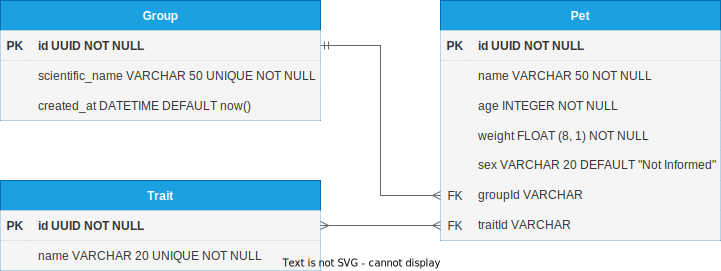

# M5 - Pet Kare

Nesse projeto foi criada uma aplicação simples para ajudar donos de PetShop a guardar dados dos pets de seus clientes. Nele, foram utilizados conceitos aprendidos nas aulas do curso de desenvolvimento full-stack da Kenzie Academy Brasil, mais especificamente referentes ao módulo 5, sprint 3 (dos dias 28/11 a 02/12) onde a temática das demos se baseiam em conceitos como Relacionamentos, Models, Views e Serializers do framework Django.
A identificação dos itens foram trabalhadas utilizando-se de id's inteiros sequenciais referenciando as suas devidas chaves primárias.
___
## Configurar o ambiente para rodar a aplicação localmente

Para poder rodar esta aplicação em sua máquina da melhor maneira possível, abra sua shell (se for um usuário do windows, opte pelo PowerShell) e execute os seguintes comandos:

1. Primeiramente, crie seu ambiente virtual:
	```bash
	python -m venv venv
	```

2. Ative seu venv:
	```bash
	# linux:
	source venv/bin/activate

	# windows:
	.\venv\Scripts\activate
	```

3. Dentro de seu ambiente virtual, instale as bibliotecas necessárias para o bom funcionamento da aplicação através do comando:
   ```bash
   pip install -r .\requirements.txt
   ```

4. Finalmente, rode o servidor local:
   ```bash
   python .\manage.py runserver
   ```

Pronto! Sua nova API esta ativa e pronta para uso. Divirta-se!
___
</br>
</br>

## **Diagrama de Entidades e Relacionamentos em que o projeto foi baseado**
</br>



</br>

___

## **Rotas & corpos de requisições da aplicação**

Todos os exemplos de interações com as rotas estão sendo dados abaixo, utilizando-se da seguinte URL Base: http://localhost:8000/api/

</br>

### **```POST pets/:```** Criação de um novo pet no banco de dados:

Rota para criação de um novo pet. Se no campo *"group"* constar um nome cientifico que já consta no banco de dados, este nome será buscado e não será criado uma cópia idêntica deste grupo. O mesmo vale para todos os índices da lista presente em *"traits"*.

**Corpo de requisição:**
```json
{
  "name": "Pandora",
  "age": 9,
  "weight": 4,
  "sex": "Female",
  "group": {
    "scientific_name": "Felis Catus"
  },
  "traits": [
    {"name": "curious"},
    {"name": "fluffy"}
  ]
}
```

</br>

**Corpo de Resposta:**
```json
{
	"id": 1,
	"name": "Pandora",
	"age": 9,
	"weight": 4.0,
	"sex": "Female",
	"group": {
		"id": 2,
		"scientific_name": "Felis Catus",
		"created_at": "2022-12-05T03:07:54.644174Z"
	},
	"traits_count": 2,
	"traits": [
		{
			"id": 3,
			"name": "curious",
			"created_at": "2022-12-05T03:07:47.749971Z"
		},
		{
			"id": 7,
			"name": "fluffy",
			"created_at": "2022-12-05T03:07:54.957622Z"
		}
	]
}
```
</br>

### **```GET pets/:```** Listagem de todos os pets cadastrados:

Rota responsável pela listagem de *TODOS* os pets já cadastrados na aplicação.

**Corpo de Resposta:**
```json
[
    {
        "id": 1,
        "name": "Pandora",
        "age": 9,
        "weight": 4.0,
        "sex": "Female",
        "group": {
            "id": 2,
            "scientific_name": "Felis Catus",
            "created_at": "2022-12-05T03:07:54.644174Z"
        },
        "traits_count": 2,
        "traits": [
            {
                "id": 3,
                "name": "curious",
                "created_at": "2022-12-05T03:07:47.749971Z"
            },
            {
                "id": 7,
                "name": "fluffy",
                "created_at": "2022-12-05T03:07:54.957622Z"
            }
        ]
    },
	{
		"id": 2,
		"name": "Apollo",
		"age": 2,
		"weight": 9.0,
		"sex": "Male",
		"group": {
			"id": 2,
			"scientific_name": "Canis Lupus",
			"created_at": "2022-12-05T03:07:54.644174Z"
		},
		"traits_count": 2,
		"traits": [
			{
				"id": 3,
				"name": "curious",
				"created_at": "2022-12-05T03:07:47.749971Z"
			},
			{
				"id": 4,
				"name": "hairy",
				"created_at": "2022-12-05T03:07:54.957622Z"
			}
		]
	},
	{
		"id": 3,
		"name": "Banguela",
		"age": 2,
		"weight": 9.0,
		"sex": "Male",
		"group": {
			"id": 2,
			"scientific_name": "Canis Lupus",
			"created_at": "2022-12-05T03:07:54.644174Z"
		},
		"traits_count": 2,
		"traits": [
			{
				"id": 3,
				"name": "curious",
				"created_at": "2022-12-05T03:07:47.749971Z"
			},
			{
				"id": 4,
				"name": "hairy",
				"created_at": "2022-12-05T03:07:54.957622Z"
			}
		]
	}
]
```

</br>

### **```GET pets/<pet_id>:```** Listagem de um único pet:

Rota responsável pela listagem de um único pet, tendo sua filtragem definida por parâmetro no corpo da URL.

**Corpo de Resposta:**
```json
{
	"id": 1,
	"name": "Pandora",
	"age": 9,
	"weight": 4.0,
	"sex": "Female",
	"group": {
		"id": 2,
		"scientific_name": "Felis Catus",
		"created_at": "2022-12-05T03:07:54.644174Z"
	},
	"traits_count": 2,
	"traits": [
		{
			"id": 3,
			"name": "curious",
			"created_at": "2022-12-05T03:07:47.749971Z"
		},
		{
			"id": 7,
			"name": "fluffy",
			"created_at": "2022-12-05T03:07:54.957622Z"
		}
	]
}
```

</br>

### **```PATCH pets/<pet_id>:```** Atualização parcial de um pet:

Rota responsável pela atualização do pet referente ao seu id, passado como parâmetro na URL. A atualização é parcial, sendo assim possível a atualização de um único atributo por requisição, bem como a atualização de todos eles de uma única vez. Uma vez que as características (traits) de um pet forem alteradas, todas as características antigas não citadas na deixarão de se relacionar com o pet em questão, mas ainda assim persistirão no banco de dados.

**Corpo de Requisição:**
```json
// Exemplo 1
{
	"name": "Pandorinha",
	"group": {
		"scientific_name": "Felis Catus II"
	},
	"traits": [
		{
			"name": "blue eyes"
		},
		{
			"name": "angry"
		}
	]
}

// Exemplo 2
{
	"name": "Pandorinha",
}

// Exemplo 3
{
  "name": "Pandorinha",
  "age": 9,
  "weight": 4,
  "sex": "Female",
  "group": {
    "scientific_name": "Felis Catus II"
  },
  "traits": [
    {"name": "blue eyes"},
    {"name": "angry"}
  ]
}
```

**Corpo de Resposta:**
```json
{
	"id": 1,
	"name": "Pandorinha",
	"age": 9,
	"weight": 4.0,
	"sex": "Female",
	"group": {
		"id": 10,
		"scientific_name": "Felis Catus II",
		"created_at": "2022-12-05T03:23:03.399034Z"
	},
	"traits_count": 2,
	"traits": [
		{
			"id": 12,
			"name": "blue eyes",
			"created_at": "2022-12-05T03:07:47.549975Z"
		},
		{
			"id": 8,
			"name": "angry",
			"created_at": "2022-12-05T03:38:15.071047Z"
		}
	]
}
```

</br>

### **```DELETE pets/<pet_id>:```** Deleção de um pet:

Rota responsável pela deleção de um pet em específico. A deleção feita é um hard delete, no qual não permitirá a persistência de dados dentro do banco de dados após a requisição bem sucedida.

``A rota retornará um`` **``204 NO CONTENT``** ``caso a requisição reconheça o id do pet passado no parâmetro da URL da requisição. Caso não, será retornado um`` **``404 NOT FOUND``**.

</br>

#### **Todos os testes manuais referentes ao que foi pedido na tarefa foram feitos, tendo todos passado com êxito retornando o resultado esperado!**

</br>
</br>

#### **Problemas ou dúvidas referentes ao desenvolvimento da aplicação?**
<div style="text-align: center"><br>
	<h3 style="font-weight: 700">Contatos</h3><br>
    <a href="https://kenzieacademybrasil.slack.com/archives/D036X87KUCV">
        
    </a>
    <a href="mailto:francisco.stenico@gmail.com">
        
    </a>
    <a href="https://www.linkedin.com/in/franciscostenico/">
        
    </a>
	<p style="font-style: italic; font-size: .75rem">Francisco Correr Stenico - Desenvolvimento Full-Stack</p>
</div>

